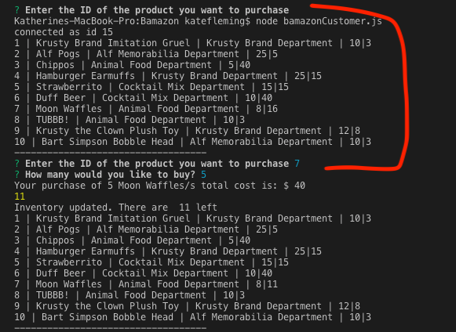
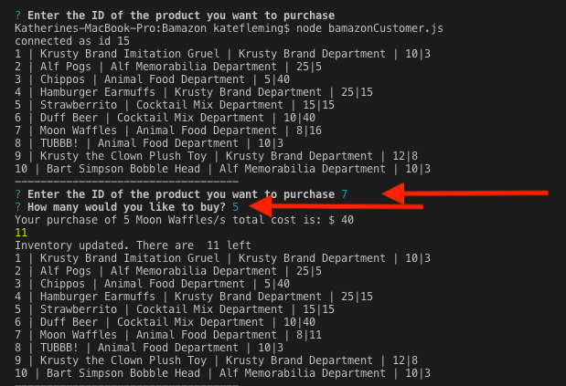
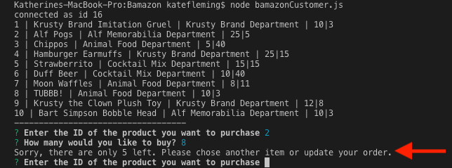
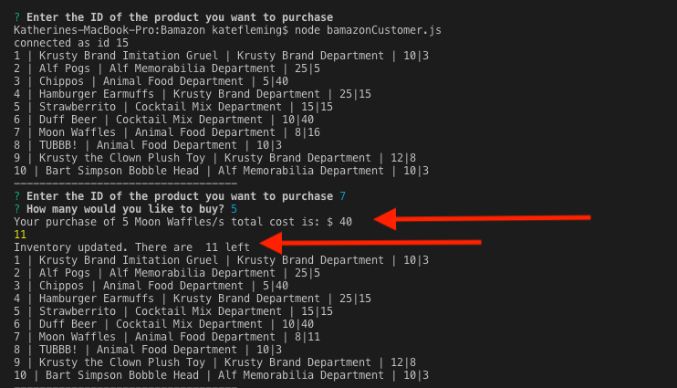

# Bamazon
This is an Amazon-like CLI application that uses Node and mySQL.

The application takes orders from customers and depletes stock from the store's inventory accordingly. 

The node application will first display all the items available for sale, including: product id, product name, department, stock quantity and the price.

The application will then prompt users with two messages:
1. The first asks them the ID of the product the would like to buy.
2. The second asks how many units of the product they would like to buy. 

Once the customer has placed their order, the application will check if the store has enough of the product to fullfill the order. If not, it will log the phrase "Sorry, there are only (however many) left. Please chose another item or update your order."

However, if the store does have enough of the product, the custmer's order is fulfilled and the total cost of their order will be displayed. The database will also update to reflect the remaining inventory. 

